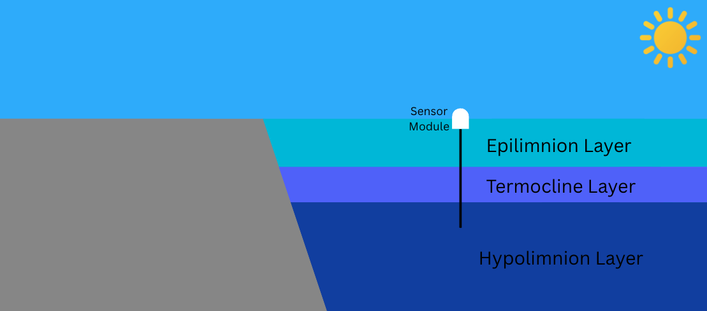

# DataLake

The DataLake system is an integrated platform designed for the systematic collection of meteorological and limnological data from lacustrine environments to support scientific research. This system quantifies key environmental parameters, including air temperature, photosynthetically active radiation (PAR), and water temperatures across the epilimnion, metalimnion, and hypolimnion; the three primary thermal strata of lakes.

## Lake Sensor: Design and Instrumentation

The lake sensor comprises a bespoke embedded circuit engineered for high-precision environmental monitoring. It integrates four temperature sensors, a photodiode for light intensity measurement, and a radio frequency (RF) module for data transmission. The core of the system is a PIC16F1938 microcontroller, which orchestrates data acquisition from multiple sensors and facilitates wireless communication with a Raspberry Pi base station via an RYLR998 transceiver.

Water temperature profiling across the lake’s vertical stratification is achieved using three TMP35 precision analog temperature sensors, deployed at discrete depths corresponding to the lake’s thermal layers. The microcontroller’s onboard temperature sensor measures ambient air temperature at the lake surface, providing a critical atmospheric reference point. Additionally, a calibrated light sensor quantifies incident solar irradiance, a key variable influencing aquatic ecosystem dynamics.

The circuit architecture prioritizes extreme low-power (XLP) operation, enabling sustained functionality at 1.6 V, powered by two 3600 mAh lithium-ion batteries, with a projected operational lifespan of two years. Firmware programming implements a duty-cycling protocol, whereby the microcontroller activates every five minutes to sample sensor outputs and transmit the aggregated dataset over a distance of up to 1.6 kilometers (1 mile) to a remote receiver. This design ensures robust, long-term data collection in remote field conditions, supporting high-resolution temporal analysis of lake system responses to environmental forcing.

## Development Stages

### Version Alpha (IN PROGRESS)

The [alpha version](https://github.com/WillCallahan/DataLake/tree/simple-sensor) of the system is designed to be created as rapidly as possible in order to create a functional product.

#### Sensor Design

1. Initial research (ONGOING)
2. Proof of concept embedded curcuit (COMPLETE)
3. Reliability testing (ONGOING)
4. Collect system packaging (COMPLETE)
5. Create deployment package (TBD)
6. Deployment (TBD)

#### Base Station Design

1. Initial research (COMPLETE)
2. Proof of concept (COMPLETE)
3. Reliabliity testing (COMPLETE)
4. Deployment (TBD)

### Version Beta

The beta version of the system is designed to be deployed at scale with reduced development and material costs, focusing on creating a custom base station.

#### Sensor Design

1. Research board design
2. Select components
3. Create printable circuit board
4. Print circuit
5. Test Circuit

#### Base Station Design

1. Initial research
2. Proof of concept
3. Reliabliity testing
4. Deployment
